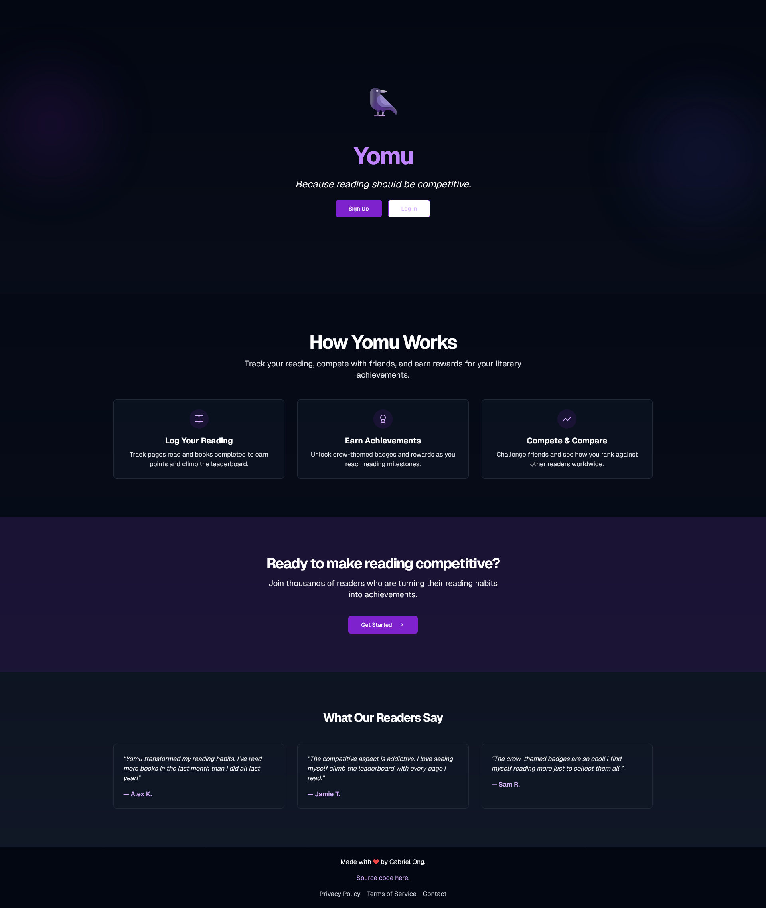
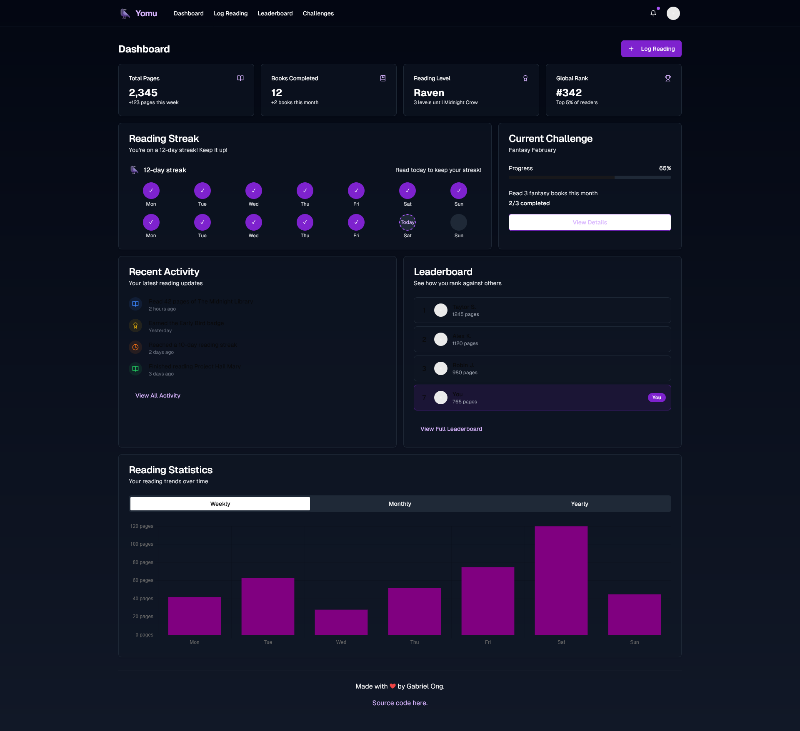
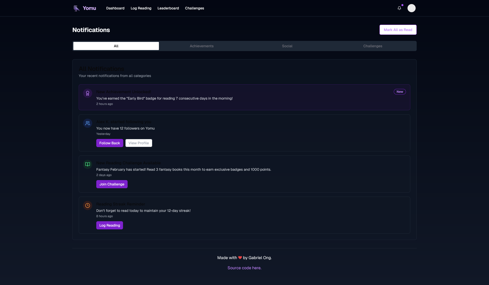
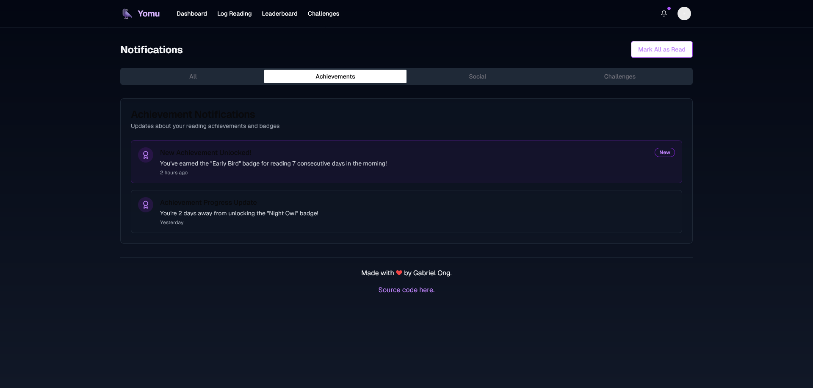
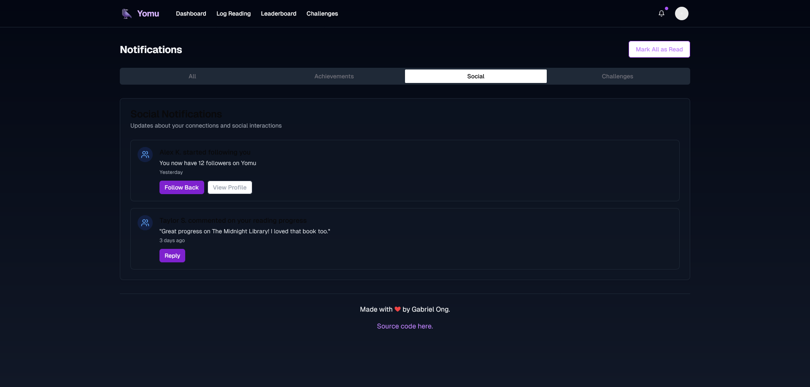
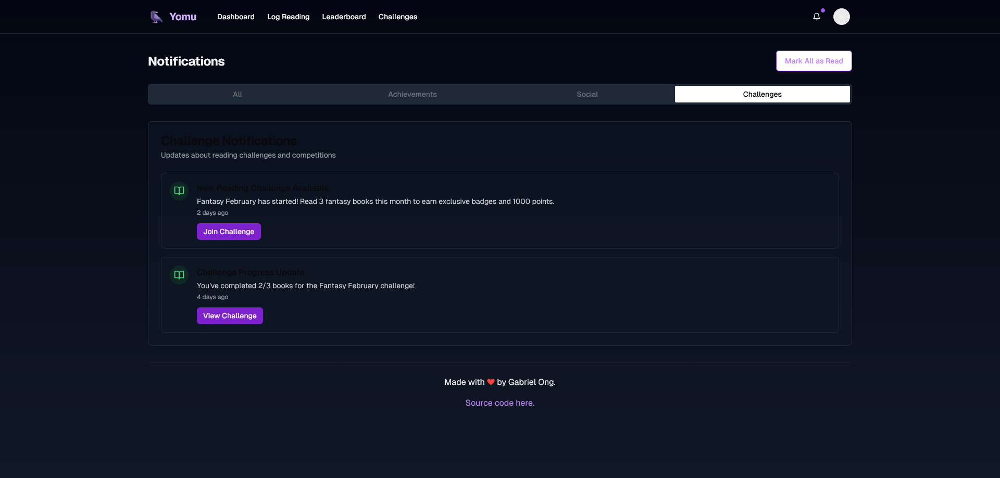
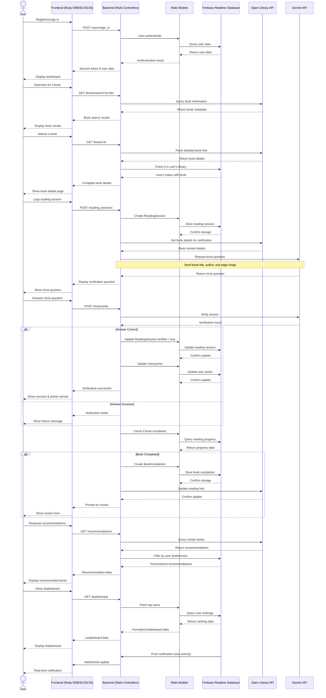
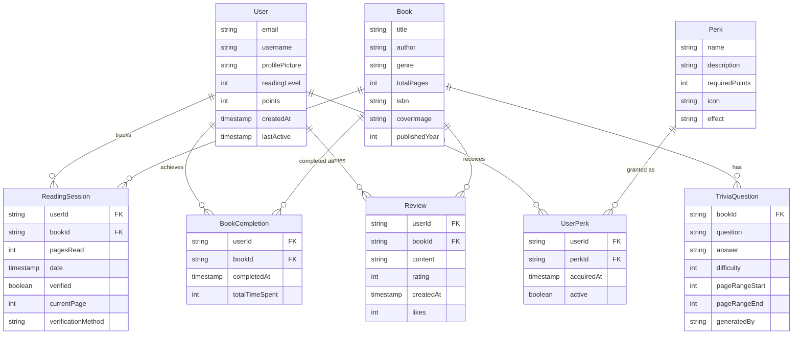

[](https://github.com/gongahkia/yomu/releases/tag/1.0.0)


# `Yomu` 🐦‍⬛

...

<div align="center">
  
</div>

## Stack

Deployed with Heroku.

* [Frontend](#architecture) *(Ruby Erb, SCSS, JavaScript)*
* [Backend](#architecture) *(Rails)*
* [DB](#database) *(Rails Models, Firebase Realtime Database)*

## Screenshot

<div style="display: flex; justify-content: space-between;">
  
  
</div>

<br>

<div style="display: flex; justify-content: space-between;">
  
  
</div>

<br>

<div style="display: flex; justify-content: space-between;">
  
  
</div>

## Usage

For local debugging.

1. Run the below.

```console
$ git clone https://github.com/gongahkia/yomu
$ bundle install && yarn install
```

2. Create a `.env` file with the below details.

```env
DATABASE_USERNAME=XXX
DATABASE_PASSWORD=XXX
FIREBASE_URL=XXX
FIREBASE_SECRET=XXX
GEMENI_API_KEY=XXX
```

3. Then run the below.

```console
$ cd yomu/yomu-app
$ rails db:create
$ rails db:migrate
$ rails db:seed
$ rails server
```

## Architecture



## Rails Models



## Database

Firebase Realtime Database Schema.

```json
{
  "users": {
    "$userId": {
      "email": "string",
      "username": "string",
      "profilePicture": "string",
      "readingLevel": "number",
      "points": "number",
      "createdAt": "timestamp",
      "lastActive": "timestamp"
    }
  },

  "books": {
    "$bookId": {
      "title": "string",
      "author": "string",
      "genre": "string",
      "totalPages": "number",
      "isbn": "string",
      "coverImage": "string",
      "publishedYear": "number"
    }
  },

  "readingSessions": {
    "$sessionId": {
      "userId": "string",
      "bookId": "string",
      "pagesRead": "number",
      "date": "timestamp",
      "verified": "boolean",
      "currentPage": "number",
      "verificationMethod": "string"
    }
  },

  "bookCompletions": {
    "$completionId": {
      "userId": "string",
      "bookId": "string",
      "completedAt": "timestamp",
      "totalTimeSpent": "number"
    }
  },

  "reviews": {
    "$reviewId": {
      "userId": "string",
      "bookId": "string",
      "content": "string",
      "rating": "number",
      "createdAt": "timestamp",
      "likes": "number"
    }
  },

  "triviaQuestions": {
    "$questionId": {
      "bookId": "string",
      "question": "string",
      "answer": "string",
      "difficulty": "number",
      "pageRange": {
        "start": "number",
        "end": "number"
      },
      "generatedBy": "string"
    }
  },

  "perks": {
    "$perkId": {
      "name": "string",
      "description": "string",
      "requiredPoints": "number",
      "icon": "string",
      "effect": "string"
    }
  },

  "userPerks": {
    "$userId": {
      "$perkId": {
        "acquiredAt": "timestamp",
        "active": "boolean"
      }
    }
  },

  "leaderboard": {
    "overall": {
      "$userId": {
        "username": "string",
        "points": "number",
        "rank": "number"
      }
    },
    "monthly": {
      "$month": {
        "$userId": {
          "username": "string",
          "points": "number",
          "rank": "number"
        }
      }
    },
    "genreSpecific": {
      "$genre": {
        "$userId": {
          "username": "string",
          "points": "number",
          "rank": "number"
        }
      }
    }
  },

  "readingChallenges": {
    "$challengeId": {
      "title": "string",
      "description": "string",
      "startDate": "timestamp",
      "endDate": "timestamp",
      "goal": "number",
      "goalType": "string",
      "reward": {
        "points": "number",
        "perkId": "string"
      },
      "participants": {
        "$userId": {
          "progress": "number",
          "joined": "timestamp",
          "completed": "boolean"
        }
      }
    }
  },

  "userStats": {
    "$userId": {
      "totalPagesRead": "number",
      "booksCompleted": "number",
      "averagePagesPerDay": "number",
      "readingStreak": "number",
      "lastReadDate": "timestamp",
      "favoriteGenres": {
        "$genre": "number"
      },
      "weeklyProgress": {
        "$week": "number"
      },
      "monthlyProgress": {
        "$month": "number"
      }
    }
  },

  "notifications": {
    "$userId": {
      "$notificationId": {
        "type": "string",
        "message": "string",
        "createdAt": "timestamp",
        "read": "boolean",
        "relatedId": "string"
      }
    }
  },

  "bookClubs": {
    "$clubId": {
      "name": "string",
      "description": "string",
      "createdBy": "string",
      "createdAt": "timestamp",
      "currentBook": "string",
      "members": {
        "$userId": {
          "role": "string",
          "joinedAt": "timestamp"
        }
      },
      "discussions": {
        "$discussionId": {
          "title": "string",
          "content": "string",
          "createdBy": "string",
          "createdAt": "timestamp",
          "comments": {
            "$commentId": {
              "userId": "string",
              "content": "string",
              "createdAt": "timestamp"
            }
          }
        }
      }
    }
  }
}
```

## Reference

The name `Yomu` is in reference to 読む *(よむ)*, which roughly translates to "read" in Japanese.

<div align="center">
    
</div>
